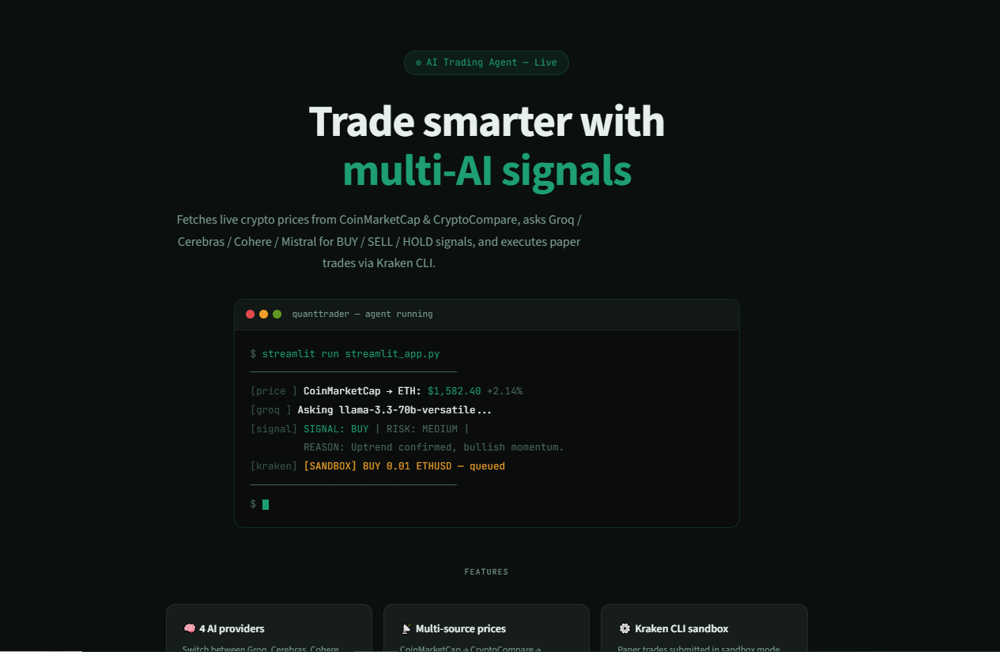
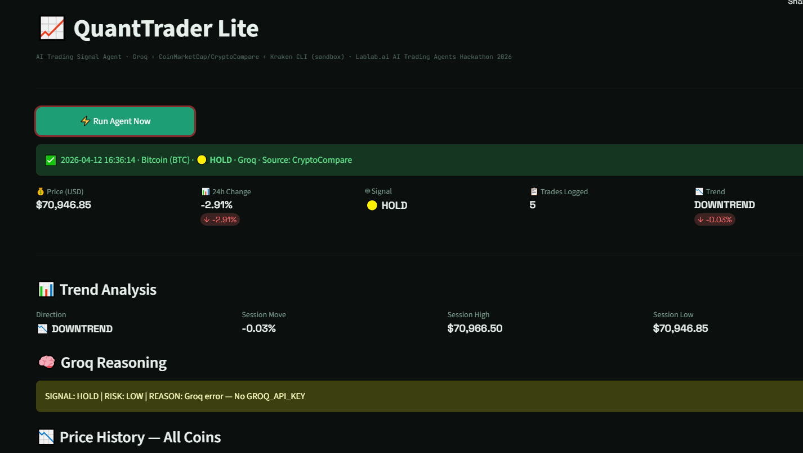
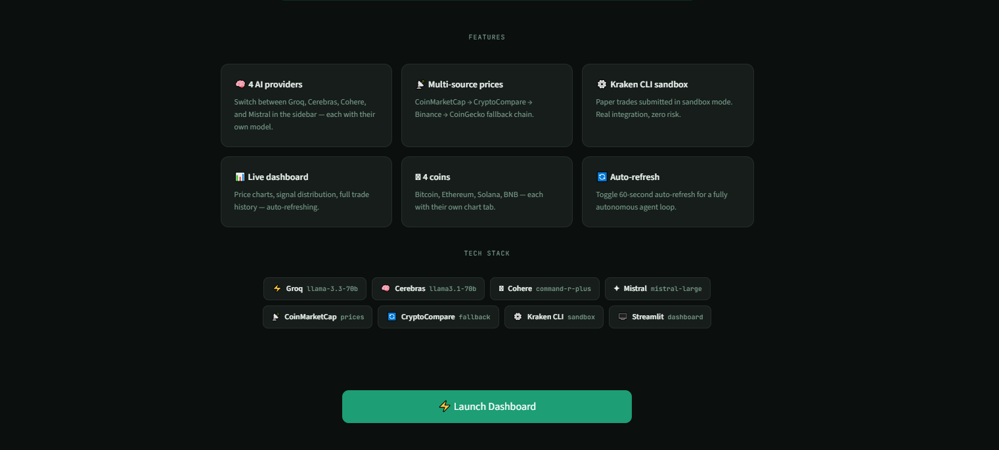

# 📈 QuantTrader Lite

> **AI-Powered Crypto Trading Signal Agent** — Lablab.ai AI Trading Agents Hackathon 2026

[](https://quant-trader-lite.streamlit.app/)
[](https://lablab.ai/ai-hackathons/ai-trading-agents)
[](#)
[](#)
[](https://quant-trader-lite.streamlit.app/)

---


##  Landing Page

<p align="center">
  
</p>

## Dashboard Preview

<p align="center">
  
</p>


##  Feature Highlights

<p align="center">
  
</p>

---
## 🧠 What is QuantTrader Lite?

QuantTrader Lite is a fully working, end-to-end AI crypto trading signal agent. It fetches live prices from multiple sources, asks **Gemini 2.0 Flash** for a **BUY / SELL / HOLD** signal with a reason, and executes paper trades via **Kraken CLI** — all visible live on a clean Streamlit dashboard.

```
Live Price  →  Gemini AI  →  Signal + Reason  →  Kraken CLI (sandbox)  →  Dashboard
```

**🔗 Try it live:** [https://quant-trader-lite.streamlit.app/](https://quant-trader-lite.streamlit.app/)


## 🏗️ Architecture

.


---

## ✨ Features

| Feature | Description |
|---|---|
| 📡 **Multi-source price data** | CoinGecko → Binance → CryptoCompare fallback chain — never fails silently |
| 🤖 **Trend-aware AI signals** | Gemini 2.0 Flash analyzes live price + session trend for smarter signals |
| 🟢🔴🟡 **BUY / SELL / HOLD** | Color-coded signals with full AI reasoning visible on every trade |
| 📊 **4 coins supported** | Bitcoin, Ethereum, Solana, BNB — each with chart tab and Kraken pair |
| 📋 **Full trade log** | Every signal logged to JSON with timestamp, price, signal, and order result |
| 🔄 **Auto-refresh** | Toggle 60-second auto-refresh for hands-free live agent operation |
| ⚙️ **Kraken CLI sandbox** | Paper trades via Kraken CLI — no real money, full execution flow |

---

## 🚀 Quickstart

### 1. Clone the repo

```bash
git clone https://github.com/your-team/quanttrader-lite
cd quanttrader-lite
```

### 2. Install dependencies

```bash
pip install -r requirements.txt
```

### 3. Set your API keys

```bash
export GEMINI_API_KEY=your_gemini_key_here
export KRAKEN_API_KEY=your_kraken_key        # optional for sandbox
export KRAKEN_API_SECRET=your_kraken_secret  # optional for sandbox
```

### 4. Run the dashboard

```bash
streamlit run streamlit_app.py
```

Open [http://localhost:8501](http://localhost:8501) and click **⚡ Run Agent Now**.

---

## 🗂️ File Structure

```
quanttrader-lite/
├── streamlit_app.py     # Main app — price fetch + Gemini AI + Kraken + dashboard
├── requirements.txt     # All Python dependencies
├── trade_log.json       # Auto-generated trade history (gitignored)
├── index.html           # Landing page for the project
└── README.md            # This file
```

---

## 🛠️ Tech Stack

| Layer | Tool | Why |
|---|---|---|
| AI Signal Engine | Gemini 2.0 Flash | Fast, reliable, free API tier available |
| Fallback AI | Groq (llama3) | Ultra-fast inference backup |
| Market Data (primary) | CoinGecko API | Free, no key needed, reliable |
| Market Data (fallback 1) | Binance Public API | No key needed, high uptime |
| Market Data (fallback 2) | CryptoCompare | Free tier, good historical data |
| Trading Execution | Kraken CLI | Pre-built binary, full sandbox support |
| Dashboard UI | Streamlit | Python-only, no frontend skills needed |
| Language | Python 3.11+ | Simple, fast, well-supported |

---

## 🔄 Workflows


### Agent Pipeline (every run)

```
User clicks ⚡ Run Agent Now
        │
        ▼
[1] Fetch Price
    Try CoinGecko → if fail → Try Binance → if fail → Try CryptoCompare
        │
        ▼
[2] Compute Trend
    Load trade_log.json → analyze last 10 prices for this coin
    → Direction: UPTREND / DOWNTREND / SIDEWAYS
    → Session High / Low / Avg / % Move
        │
        ▼
[3] Ask Gemini AI
    Send: coin, price, 24h change, trend context
    Receive: SIGNAL: BUY/SELL/HOLD | RISK: LOW/MEDIUM/HIGH | REASON: ...
        │
        ▼
[4] Execute Trade (Kraken CLI Sandbox)
    BUY  → kraken order buy  <pair> <amount> --sandbox
    SELL → kraken order sell <pair> <amount> --sandbox
    HOLD → no order placed
        │
        ▼
[5] Log Trade
    Append to trade_log.json:
    { timestamp, coin, price, change_24h, signal, trade, source }
        │
        ▼
[6] Update Dashboard
    Metrics · Trend panel · AI reasoning box · Charts · Trade table
```

### Auto-Refresh Workflow

```
Toggle ON "🔄 Auto-refresh every 60s"
        │
        ▼
    Dashboard sleeps 60 seconds
        │
        ▼
    st.rerun() triggers full page reload
        │
        ▼
    Agent pipeline runs again automatically
        │
        └──── loops indefinitely until toggle OFF
```

### Price Fallback Workflow

```
Request price for coin
        │
        ▼
    CoinGecko API ──── success ──▶ return (price, change, "CoinGecko")
        │
      fail
        │
        ▼
    Binance API ────── success ──▶ return (price, change, "Binance")
        │
      fail
        │
        ▼
    CryptoCompare ──── success ──▶ return (price, change, "CryptoCompare")
        │
      fail
        │
        ▼
    RuntimeError: "All price sources failed" → show error in dashboard
```

---

## 📊 Signal Logic

Gemini AI follows these rules when generating signals:

| Condition | Signal |
|---|---|
| Trend = UPTREND **and** 24h change > +1% | 🟢 **BUY** |
| Trend = DOWNTREND **and** 24h change < -1% | 🔴 **SELL** |
| Sideways, uncertain, or mixed signals | 🟡 **HOLD** |
| Any condition | Max 2% portfolio risk enforced |

---

## 🪙 Supported Coins

| Coin | CoinGecko ID | Binance Pair | Kraken Pair |
|---|---|---|---|
| Bitcoin | `bitcoin` | `BTCUSDT` | `XBTUSD` |
| Ethereum | `ethereum` | `ETHUSDT` | `ETHUSD` |
| Solana | `solana` | `SOLUSDT` | `SOLUSD` |
| BNB | `binancecoin` | `BNBUSDT` | `BNBUSD` |

---

## 🔑 API Keys Needed

| Service | Required | Where to get |
|---|---|---|
| Gemini API | ✅ Yes | [aistudio.google.com](https://aistudio.google.com) |
| Groq API | Optional (fallback AI) | [console.groq.com](https://console.groq.com) |
| CryptoCompare | Optional (price fallback) | [cryptocompare.com/cryptopian/api-keys](https://www.cryptocompare.com/cryptopian/api-keys) |
| CoinMarketCap | Optional (extra data) | [coinmarketcap.com/api](https://coinmarketcap.com/api) |
| Messari | Optional (market intel) | [messari.io/api](https://messari.io/api) |
| CoinGecko | ❌ Free, no key | Built-in |
| Binance | ❌ Free, no key | Built-in |
| Kraken CLI | For real trades | [kraken.com/u/security/api](https://kraken.com/u/security/api) |

---

## ✅ Submission Checklist

- [x] Working Streamlit app (AI + Kraken CLI + price feeds)
- [x] Multi-source price fallback (CoinGecko → Binance → CryptoCompare)
- [x] Gemini AI signal with trend context and reasoning
- [x] Kraken CLI sandbox trade execution
- [x] Trade log (JSON) with full history
- [x] Live dashboard with charts, metrics, signal distribution
- [x] GitHub repository (public)
- [x] Live deployment: [quant-trader-lite.streamlit.app](https://quant-trader-lite.streamlit.app/)
- [ ] Demo video (2–3 min screen recording)
- [ ] Social media post (X / LinkedIn)
- [ ] Register on [early.surge.xyz](https://early.surge.xyz)
- [ ] Submit on Lablab.ai before April 12

---

## 👥 Team

| Member | Role |
|---|---|
| Member 1 | Python Dev — AI agent, Kraken CLI, price APIs |
| Member 2 | Dashboard — Streamlit UI, charts, signal display |
| Member 3 | Presenter — Demo video, README, pitch |

---

## 📄 License

MIT License — free to use, modify, and distribute.

---

<div align="center">

**QuantTrader Lite · Lablab.ai AI Trading Agents Hackathon 2026 · Kraken CLI Challenge**

[🚀 Live Demo](https://quant-trader-lite.streamlit.app/) · [🏆 Hackathon Page](https://lablab.ai/ai-hackathons/ai-trading-agents) · [📋 Prize Registration](https://early.surge.xyz)

</div>
